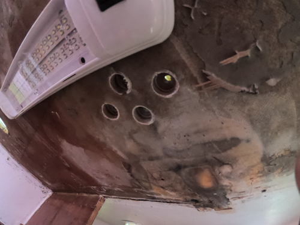

<head>
<!-- Global site tag (gtag.js) - Google Analytics -->

</head>

#[Conifer Sailing](index.html "Back to Conifer Sailing - Home")

## Prepping Deck Holes

The goal here was to surround any hole through the deck with a cylinder of epoxy. This ensures no water penetration into the core material in the event that the deck hardware is strained to the point where the sealant begins to fail. 

Here's what I did:

1. Remove all hardware
2. Overdrilled the bolt holes from the bottom up, stopping short of overdrilling the outer skin. This meant that the holes as viewed from above the deck were unchanged.
3. Sand underside edge of hole and tape from underneath
4. Fill with small amount of thickened epoxy
5. Saturate with penetrating epoxy
6. Fill to top with thickened epoxy
7. Re-drill hole
8. Countersink hole with 5/8" countersink

**Video!**

    <iframe width="560" height="315" src="https://www.youtube.com/embed/f4S497-pfSc" frameborder="0" allow="accelerometer; autoplay; encrypted-media; gyroscope; picture-in-picture" allowfullscreen></iframe>

*Holes Prepped for Epoxy*

After sanding and re-painting the decks, I will re-bed all of the hardware. The best method I have learned of is countersinking holes and using butyl tape. See the very detailed writeup over at <a href="https://marinehowto.com/bed-it-tape/">https://marinehowto.com/bed-it-tape</a>.

