<head>
<!-- Global site tag (gtag.js) - Google Analytics -->

</head>

#[Conifer Sailing](index.html "Back to Conifer Sailing - Home")

##[Fixing the Port Bulkhead](9-fixing_the_port_bulkhead.html "Fixing the Port Bulkhead")

Published: Sun 02 Jun 2019

The port bulkhead had water damage from a leak due to improper sealing of the mast step. Conifer's mast is deck-stepped, so the only place where water can enter the boat is through a small hole in the mast step where the wiring passes. The mast step is designed to keep the mast in place while allowing any water that might enter the mast to drain. Unfortunately, a previous owner had applied silicone caulk around the edge of the mast step, essentially plugging the drains. This caused water to build up in the mast until it entered the wiring pass-through. The results, over years, are self explanatory.

**Video!**

    <iframe width="560" height="315" src="https://www.youtube.com/embed/f4S497-pfSc" frameborder="0" allow="accelerometer; autoplay; encrypted-media; gyroscope; picture-in-picture" allowfullscreen></iframe>

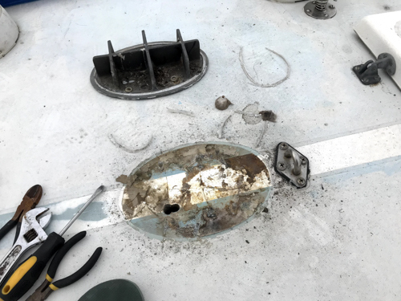
*Mast Step*

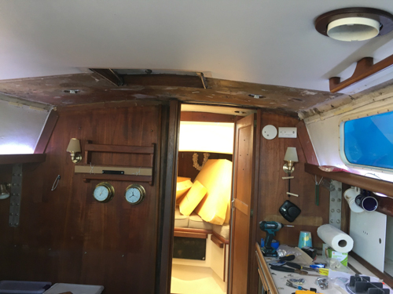
*Bulkhead - Trim and compression post hides the rot*

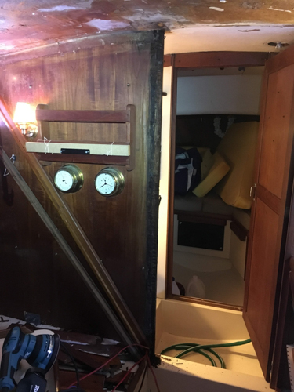
*Port Bulkhead Rot*

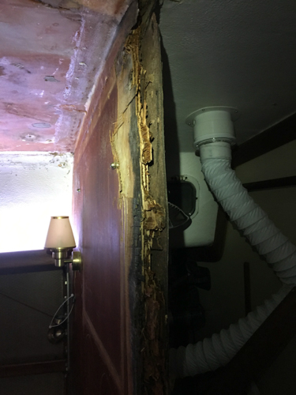
*More Bulkhead Rot*

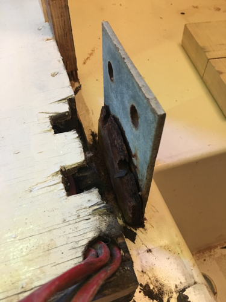
*Rust on the center beam tab*

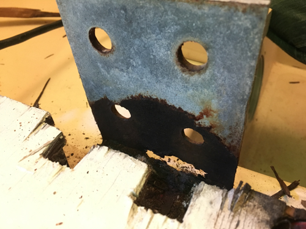
*The resulting deterioration*

Luckily the rust was limited to the connection between the tab and the main beam. After cutting the old tab off I was able to confirm that the beam below was in serviceable shape and could accept a new tab.

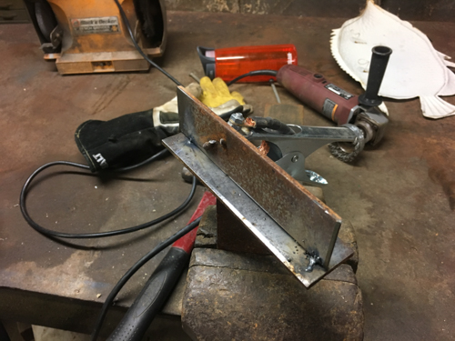
*Practicing on a similar piece*

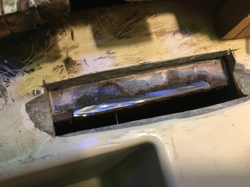
*Old Tab Ground Off*

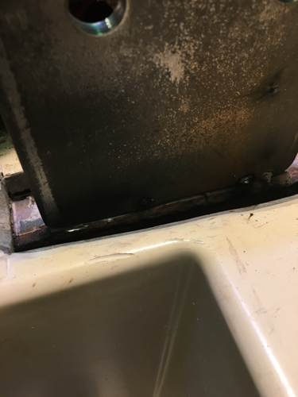
*Tack welds on the new tab*

The weld came out well but I didn't get a picture of it before glassing over it.

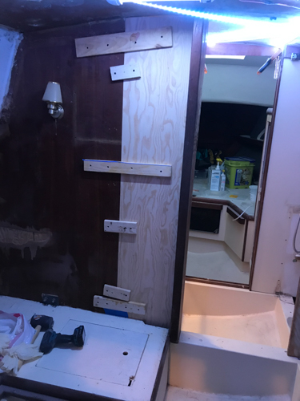
*New Bulkhead Tabbed In*

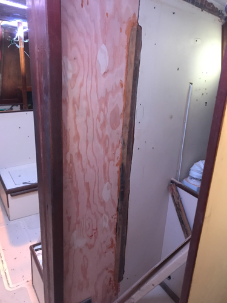
*Glassed In*

*Smoothed*

Next up - properly sealing deck hardware holes.

